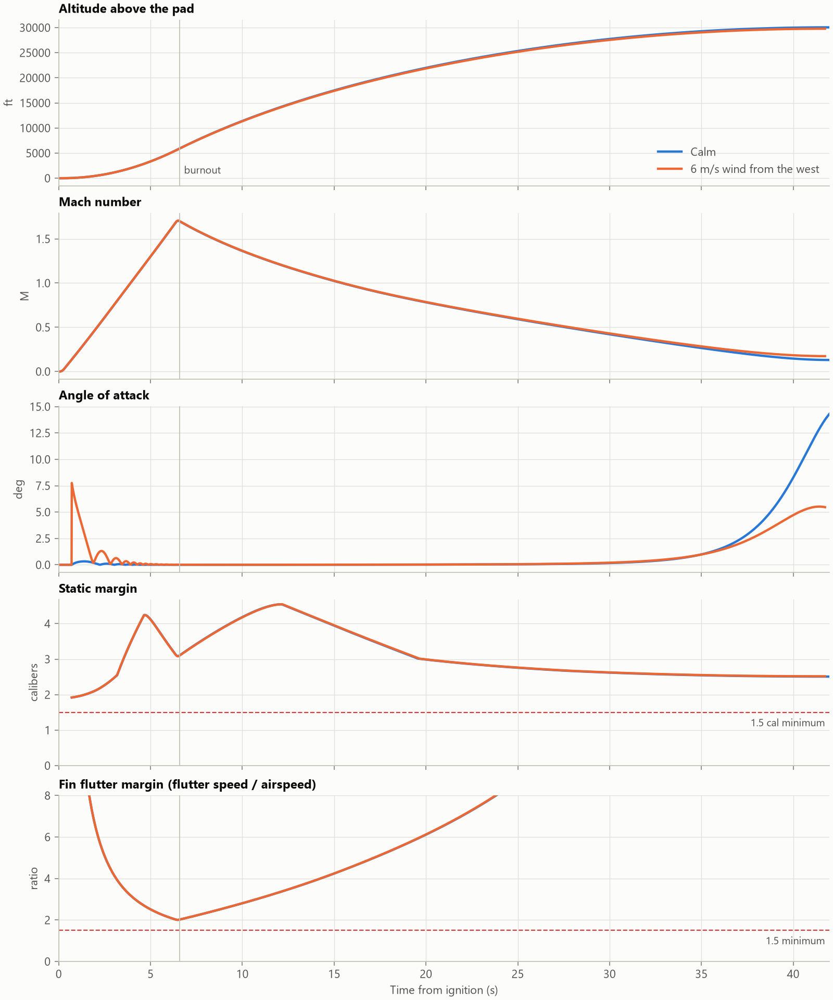
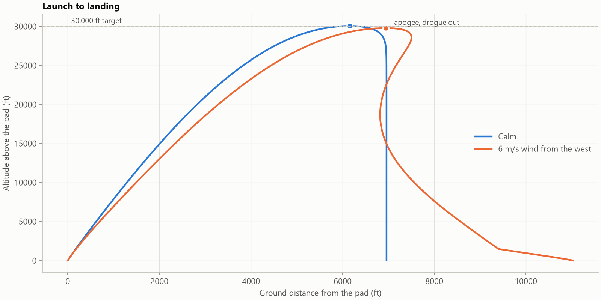
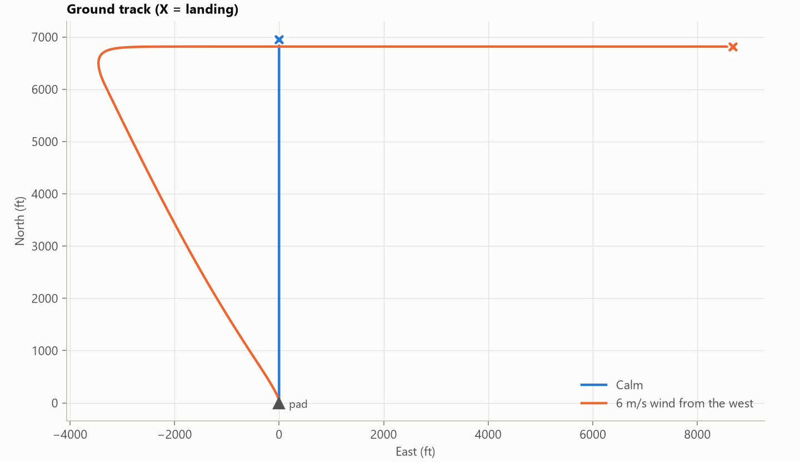
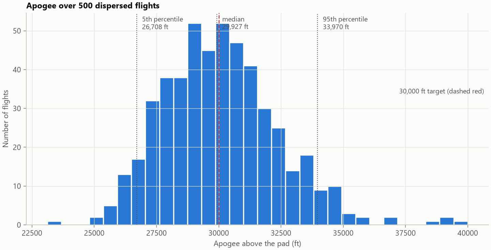
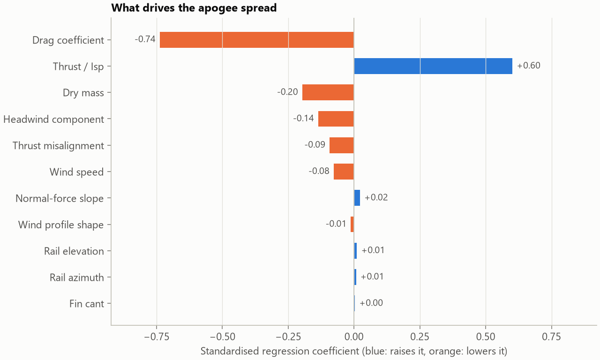
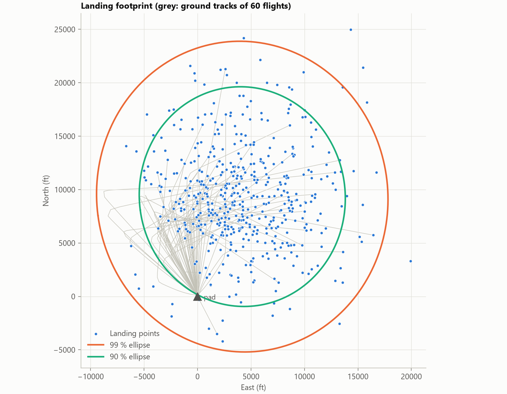
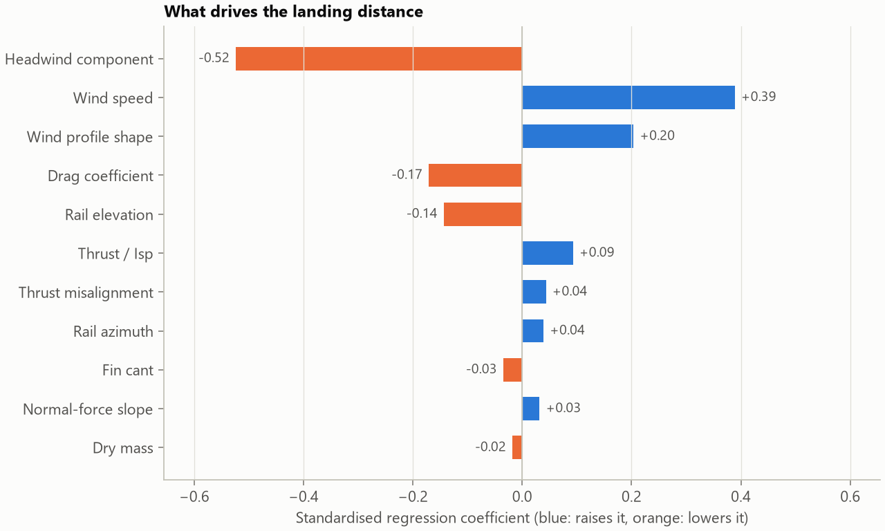

# 6-DOF Flight Simulator for a Liquid Sounding Rocket

A six-degree-of-freedom flight simulator, written from scratch in Python. It
designs, flies and stress-tests a student-scale liquid rocket built around
the **E5-75 engine**, a 5 kN LOX / ethanol engine designed with my
[Liquid Rocket Engine Design Tool](https://github.com/momokazmi1017/LiquidRocketEngineprelimdesigntool).

The mission is the **Spaceport America Cup 30,000 ft category**: reach
30,000 ft above a launch site at 4,600 ft elevation, then recover under
parachutes.

The pipeline:
1. **Size** the vehicle: choose the propellant load and fin size for the target
   apogee and a safe static margin.
2. **Fly** it with the full 6-DOF: launch rail, powered flight, coast, drogue and main descent.
3. **Check** it: stability, fin flutter and recovery requirements.
4. **Disperse** it: 500 Monte Carlo flights with realistic uncertainties give
   the apogee spread, the landing footprint and what drives each.

Every model is validated against exact solutions or published tables (see
[Validation](#validation)).

## The vehicle

`python examples/size_vehicle.py`

| Design | Value |
|---|---|
| Engine | E5-75, 5.0 kN sea level / 5.64 kN vacuum, Isp 224 s / 253 s |
| Burn time | 6.32 s (sized for the target apogee) |
| Propellant | 14.9 kg LOX / 75 % ethanol, integral aluminium tanks |
| Airframe | 6.0 in diameter, 4.03 m long, 5:1 tangent-ogive nose |
| Mass | 54.4 kg at liftoff, 39.5 kg dry (incl. 4 kg payload) |
| Total impulse | 35,700 N·s (N class) |
| Fins | 4 × G10, 190 / 63 mm root / tip, 95 mm span, **6.35 mm thick** |
| Pressurant | 2.3 L COPV of nitrogen at 300 bar |
| Launch | 40 ft tower at 84°, Spaceport America (1,401 m elevation) |

The mass model sizes the tank walls from hoop stress at the tank pressure
(2.0 mm, set by the handling minimum), and sizes the nitrogen bottle from the
tank volume it has to empty. The centre of gravity and inertia are tracked
as the tanks drain.

## Nominal flight

`python examples/nominal_flight.py`

| Result | Calm | 6 m/s wind from the west |
|---|---|---|
| Apogee above the pad | **30,057 ft** | 29,781 ft |
| Time to apogee | 42.0 s | 41.7 s |
| Rail exit speed | 149 ft/s (≥ 100 required) | 149 ft/s |
| Burnout | 6.5 s at 5,900 ft | 6.5 s at 5,890 ft |
| Max Mach / max dynamic pressure | 1.70 / 140 kPa | 1.71 / 140 kPa |
| Max angle of attack, powered | 0.3° | 7.8° (weathercocking) |
| Minimum static margin | 1.99 cal | 1.99 cal |
| Minimum fin flutter margin | 2.01 | 2.01 |
| Descent rate: drogue / at landing | 102 / 20 ft/s | 102 / 20 ft/s |





In the crosswind the rocket turns into the wind as it leaves the tower. The
angle of attack peaks at 7.8° and the oscillation damps out within about 2 s,
so apogee ends up about 3,500 ft upwind. The drogue then carries it 12,000 ft
downwind, because the wind is stronger at altitude.

### Design change: fin flutter

The first sizing used 3/16 in (4.8 mm) G10 fins. The flutter check (NACA TN 4197)
put them at a **flutter margin of 1.32** at burnout. That is Mach 1.7 in dense
air, and below the usual 1.5 minimum. Moving to 1/4 in fins raised the margin to
2.01, but the extra drag cost 570 ft of apogee, so the vehicle was re-sized
(burn time 6.22 s → 6.32 s).

## Monte Carlo dispersion analysis

`python examples/monte_carlo.py` runs 500 flights (52 s on 24 cores, fixed seed).

| Uncertainty | Distribution |
|---|---|
| Thrust / specific impulse | ±3 % (1σ) |
| Zero-lift drag | ±10 % |
| Normal-force slope | ±5 % |
| Dry mass | ±2 % |
| Thrust misalignment | 0.1° (half-normal), random direction |
| Net fin cant | 0.1° |
| Rail elevation / azimuth | 84° ± 0.5° / ± 2° |
| Surface wind | 0–8 m/s uniform, from 240° ± 40°, profile exponent 0.10–0.20 |
| Parachute drag areas | ±10 % each |



| Apogee | Value |
|---|---|
| Mean ± 1σ | 30,080 ± 2,330 ft |
| 5th / 50th / 95th percentile | 26,710 / 29,930 / 33,970 ft |
| Flights within ±10 % of 30,000 ft | 82 % |



**Drag and thrust uncertainty dominate the apogee spread.** Their squared
standardised coefficients (0.74² + 0.60²) account for about 90 % of the
variance, and wind barely matters for apogee. So to hit the target more
reliably, the best return on effort is **measuring drag** (wind tunnel, CFD,
or reconstructing it from a subscale flight) and **characterising the
engine on a test stand**, not better wind forecasts.



| Landing | Value |
|---|---|
| 99 % landing ellipse, semi-axes | 13,600 × 14,600 ft |
| Farthest edge of the 99 % ellipse from the pad | 24,600 ft (4.7 mi) |



The landing footprint is almost entirely wind: its speed, direction and how
it grows with altitude. A headwind (wind blowing toward the pad from the
direction the rail leans) shortens the landing distance. That supports the
usual practice of leaning the rail into the wind on launch day.

**Worst cases over all 500 flights**: every requirement is met.

| Check | Worst case | Requirement |
|---|---|---|
| Static margin | 1.96 cal | ≥ 1.5 |
| Fin flutter margin | 1.77 | ≥ 1.5 |
| Rail exit speed | 139 ft/s | ≥ 100 ft/s |
| Descent rate at landing | 23.5 ft/s | ≤ 30 ft/s |
| Failed flights | 0 | 0 |

**Roll.** Fin misalignment spins the rocket up to 1,400 °/s in the worst case
(0.27° of cant, about 3σ). In that flight the roll rate crosses the pitch
natural frequency about 2 s after launch, at Mach 0.5 and low dynamic
pressure, and stays above it afterwards. No resonant growth appears (peak
angle of attack 0.6° in calm air). Even so, fins should be aligned to within
0.1° when built.

## How the simulator works

| Module | What it does |
|---|---|
| [`atmosphere.py`](flightsim/atmosphere.py) | U.S. Standard Atmosphere 1976 (0–86 km), Sutherland viscosity, inverse-square gravity |
| [`engine.py`](flightsim/engine.py) | Engine data imported from the engine design tool. F = s(t)·F<sub>vac</sub> − p<sub>a</sub>A<sub>e</sub>, with start-up and tail-off ramps. Propellant use integrates the throttle profile exactly |
| [`aero.py`](flightsim/aero.py) | Normal force: nose from slender-body theory. Fins from Barrowman/Diederich below Mach 0.8 and Ackeret thin-wing theory with the finite-span tip-loss correction above. Centre of pressure. Zero-lift drag buildup: skin friction with roughness and compressibility, base drag (reduced while the engine fires), fin leading-edge and trailing-edge drag, nose wave drag |
| [`vehicle.py`](flightsim/vehicle.py) | Section-by-section layout, tank and COPV sizing, time-varying mass, CG and inertia |
| [`sizing.py`](flightsim/sizing.py) | Fast point-mass trajectory; solves for burn time (apogee) and fin scale (static margin) |
| [`sim.py`](flightsim/sim.py) | The 6-DOF, described below |
| [`structures.py`](flightsim/structures.py) | Fin flutter speed (NACA TN 4197) |
| [`montecarlo.py`](flightsim/montecarlo.py) | Dispersions, confidence ellipses, standardised-regression sensitivity |

**The 6-DOF** ([`sim.py`](flightsim/sim.py)):

- **State:** 13 numbers: position, velocity, attitude quaternion and body rates,
  in an East-North-Up frame at the pad.
- **Normal force, component by component:** evaluated separately for the nose
  and the fins, each from the airflow it sees locally (v + ω × r). One
  expression then gives both the weathercock stiffness and the aerodynamic
  pitch damping.
- **Other loads:** jet damping from the exhaust, roll forcing from fin cant,
  roll damping, thrust misalignment, and a power-law wind profile.
- **Flight phases:** launch rail (constrained to 1-D), then free flight to
  apogee (DOP853 integrator, restarted at every thrust discontinuity), then
  3-DOF descent under the drogue and main.

## Validation

| Check | Reference | Result |
|---|---|---|
| Atmosphere, 0–50 km | U.S. Standard Atmosphere 1976 tables | T within 0.01 K, p and ρ within 0.1 % |
| Torque-free spinning body | Conservation of angular momentum and energy; analytic precession rate | to 10<sup>-8</sup> |
| Vacuum vertical launch | Rocket equation with gravity loss; energy conservation to apogee | 0.2 % / 0.001 % |
| Pitch stiffness and damping | Closed-form linear derivatives Σ CN<sub>α,i</sub>(x<sub>i</sub> − x<sub>cg</sub>)<sup>n</sup> | to 10<sup>-6</sup> |
| 6-DOF vs point mass in calm air | Independent sizing model | apogee within 0.2 % |
| Fin lift and centre of pressure at low Mach | Barrowman's closed-form equations | exact |
| Crosswind response | Physical behaviour | turns upwind, lands downwind |
| Parachute descent | Terminal velocity √(2mg / ρC<sub>D</sub>A) | within 1 % |
| Confidence ellipse, sensitivity method | Gaussian samples with known statistics | exact to sampling error |

All of these run as tests (`pytest`, 21 tests).

## Limitations

- **Aerodynamics** are semi-empirical. The ogive nose wave drag is scaled
  from a cone correlation. The transonic region is a linear blend between
  subsonic and supersonic theories. Body lift and the effect of angle of
  attack on drag are neglected. The Monte Carlo carries ±10 % drag and ±5 %
  normal force because of this. A comparison against OpenRocket or wind-tunnel
  data is the natural next check.
- **Earth** is flat and non-rotating. At 9 km apogee and about 7 km range, the
  Coriolis and curvature effects are small next to the wind uncertainty.
- **Structure** is rigid (no body bending). The flutter formula is a
  flat-plate estimate, so a margin of 1.5 or more is required, not merely above 1.
- **Recovery:** parachutes open instantly (no inflation dynamics or opening
  shock), and deployment happens exactly at apogee.
- **Roll coupling:** only fin cant and thrust misalignment are modelled, so
  roll-resonance lock-in driven by other asymmetries (mass offset,
  manufacturing bumps) is not.
- **Engine:** runs at a fixed operating point. Chamber pressure does not
  change as the tanks drain (the tanks are regulated).

## Setup

```
python -m venv .venv
.venv\Scripts\python.exe -m pip install -r requirements.txt
.venv\Scripts\python.exe examples\size_vehicle.py
.venv\Scripts\python.exe examples\nominal_flight.py
.venv\Scripts\python.exe examples\monte_carlo.py
.venv\Scripts\python.exe -m pytest
```

To import an updated engine from the engine design tool:
`python tools/import_engine.py ../LiquidRocketEngine/outputs/E5-75/design_summary.json`
